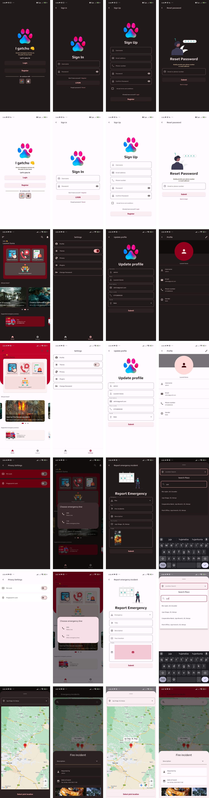

# I GATCHU

**Portfolio: I Gatchu - Emergency Access and Psychosocial Support App**

**Introduction:**
I Gatchu is a cutting-edge mobile application designed to provide users with instant access to emergency assistance and psychosocial support. Leveraging advanced technology and intuitive design, I Gatchu aims to revolutionize emergency response and community safety, empowering users to navigate crises with confidence and resilience.

**Features:**

1. **Emergency Reporting:** Users can swiftly report various emergencies, such as fires, accidents, medical crises, and more, using the intuitive interface of I Gatchu. The app ensures prompt notification to relevant authorities, facilitating quick and effective response to critical situations.

2. **Comprehensive Emergency Details:** I Gatchu offers comprehensive details about reported emergencies, including the type of incident, precise location on OpenStreetMap, severity level, and any additional relevant information. Users can access real-time updates to stay informed about unfolding events.

3. **Interactive Map View:** Integrated with OpenStreetMap, I Gatchu provides an interactive map view that displays the precise locations of reported emergencies. Users can visualize the geographic distribution of incidents and nearby support resources, enhancing situational awareness and response coordination.

4. **Emergency Assistance Directory:** The app features an extensive directory of emergency assistance services, including contact information for emergency responders, medical facilities, and support organizations. Users can quickly locate and connect with relevant resources to receive timely assistance and guidance.

5. **Psychosocial Support Hub:** Recognizing the importance of mental health and well-being during emergencies, I Gatchu offers a dedicated psychosocial support hub. Users can access resources, helplines, and support groups to address emotional distress, trauma, and coping challenges.

6. **Secure Authentication:** I Gatchu ensures user privacy and data security through JSON Web Token (JWT) authentication. Users can securely log in to the app and access personalized features while safeguarding their sensitive information.

7. **Real-time Updates and Alerts:** Utilizing Riverpod for state management, I Gatchu delivers real-time updates and alerts to users, keeping them informed about emergency situations, relevant news, and community events. Push notifications ensure timely delivery of critical information.

**Technology Stack:**

- **Backend:**
  - Express TypeScript for backend development
  - Prisma ORM for efficient database management
  - MySQL database for data storage and retrieval
  - JSON Web Token (JWT) for secure authentication

- **Frontend:**
  - Flutter for cross-platform mobile development
  - Riverpod for robust state management
  - Google Maps for interactive map visualization
  - Go Router for seamless navigation and routing

**Benefits:**

- **Efficient Emergency Response:** I Gatchu streamlines emergency reporting and response processes, facilitating rapid assistance and intervention during critical situations.
- **Enhanced Community Safety:** By empowering users to report emergencies and access support services, I Gatchu fosters a safer and more resilient community environment.
- **Holistic Support:** The app's comprehensive features address both practical and emotional needs, providing users with essential assistance and psychosocial support during times of crisis.
- **User-Centric Design:** With its user-friendly interface and intuitive functionality, I Gatchu prioritizes user experience and accessibility, ensuring seamless interaction for users of all backgrounds and skill levels.

**Conclusion:**
I Gatchu represents a paradigm shift in emergency access and psychosocial support technology, leveraging advanced tools and innovative design to empower users and strengthen community resilience. With its comprehensive features, robust technology stack, and commitment to user safety and well-being, I Gatchu stands as a beacon of hope and support in times of uncertainty and crisis.

<picture>
  
</picture>
